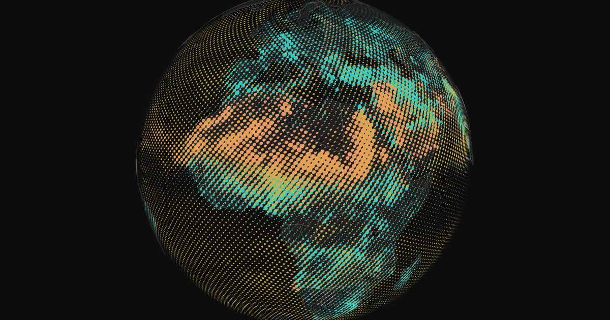

# Air Atlas — Who Owns the Air?



**[Open the atlas](https://pkrunal26.github.io/air-pollution-map/)** · [Data study](https://pkrunal26.github.io/air-pollution-map/study.html)

An interactive globe of modelled air quality. 28 Copernicus CAMS fields are printed as halftone ink, one colour plate per pollutant, and 48 hours of forecast can be played forward. Everything runs in the browser from saved, checksummed model grids, with no backend.

A globe-first environmental atlas with a single system font, a top search bar, and one tabbed layer panel. Drag Earth, search any of 237 major cities (offline, no geocoding service) or type coordinates such as `48.85, 2.35`, and zoom closer. The Globe selector switches between a neutral white surface, charcoal and NASA satellite imagery without changing the data, camera or paint strengths. White uses ivory land and blue-grey oceans, with stronger pigment contrast and coverage for visibility. This display adjustment does not change the concentration fields or relative layer weights. Neutral surfaces include subdued country outlines; the existing ocean specular texture supplies the land/water mask.

## Real data, first layer

The PM2.5 readout fetches current-time **modeled estimates** from CAMS global atmospheric composition forecasts through Open-Meteo. It uses `domains=cams_global` consistently for all cities, with roughly 45 km grid resolution. These are area estimates, not local sensor readings, source attribution, personal exposure estimates, or citywide averages.

The globe shows all 15 fields in the native CAMS global archive: PM2.5, PM10, nitrogen dioxide, ozone, dust, carbon monoxide, sulphur dioxide, aerosol optical depth, UV index, clear-sky UV index, formaldehyde, glyoxal, peroxyacyl nitrates, sea salt aerosol and nitrogen monoxide: 900 × 451 cells at 0.4° (roughly 45 km), or 405,900 cells per layer. All 15 arrays are extracted from the same 03:00 UTC forecast-valid time on 9 October 2026 and the same 12:00 UTC model run on 8 October. The bulk archive's hierarchical OM file records grid projection, timestamps and individual variable units. Those are checked before extraction. Native source arrays are preserved. Display dots interpolate those values onto an equal-area spherical distribution; this does not increase the scientific resolution.

`global-air-native.json` records source URL, valid time, model reference time, units, grid layout, ranges and SHA-256 hashes. `global-air-native.bin` holds the decoded source float32 values in little-endian, layer-major order. The browser checks length, field order, checksum and every value before display; unavailable or invalid fields show an error. The binary is 24,354,000 bytes. Schema 5 records a unit per field: concentrations in µg/m³, dimensionless AOD and UV indices. This is a saved global snapshot, not an automatically refreshing feed.
Each layer has a fixed pigment colour and its own fixed visual range, defined in `src/camsFields.json`. Ranges are display scales, not health thresholds or comparable doses. AOD represents the whole atmospheric column at 550 nm; UV is an index. PM2.5 and dust are on at first load; every other layer starts off. On the very first visit (not embedded, and not when the URL sets `layers=`) a short picker offers the seven common pollutants, with PM2.5 and dust preselected; changes show on the globe immediately, and the choice is remembered in `localStorage` (`air-atlas.onboarded`) so it is asked only once. Opening Layers or pressing Escape also closes it. Dust uses a wider 0–300 µg/m³ range than the other particle fields so structure inside a plume stays visible instead of saturating into flat plateaus. An on-map colour key lists each enabled layer with its range. Near-uniform fields (area-weighted, cos(lat), coefficient of variation below 0.5; today only ozone; regional CO would qualify on its own but follows its global verdict) use a baseline-aware scale instead: `(value − p5) / (p99 − p5)` clamped to 0–1, with p5 and p99 computed once per dataset (global and regional separately, `src/fieldStats.js`), so the ubiquitous background draws no dots and only departures from it show. Those layers also draw with muted ink (plate coverage ×0.55, same hue and plate mixing); this is per-layer emphasis, not value encoding. The key and layer panel show the mapped span (e.g. 26 → 126 µg/m³, above typical). `emphasis: "muted"|"normal"` in `src/camsFields.json` overrides the CV rule. Hover and composition values stay raw. Concentration sets the local pigment weight; the paint-strength slider scales only that visual weight. Concentration is encoded as halftone dot size, never opacity (see below); where plates overlap, a single shader combines pigment absorption in logarithmic colour space. Mixing is independent of toggle order. This is an artistic pigment model, not a physical aerosol colour simulation, combined health index or chemical reaction. Dust overlaps particulate matter and is not an additional independent source contribution.

Dots form a regular halftone screen on a Fibonacci sphere with approximately uniform nearest-neighbour spacing and equal surface area per sample, including around both poles. The lattice is fixed to the Earth and rotates with the globe; there is no jitter, shuffled draw order, per-dot size noise or per-dot rotation. Each dot samples the native field by bilinear interpolation at its exact latitude and longitude; these are display samples, not additional observations or monitoring stations. Value is encoded by dot radius and every dot is solid ink: zero or missing data draws nothing, and the only partial alpha is the one-pixel antialiased edge. Radius is area-proportional, `r = 0.56 × sqrt(clamp(value / range, 0, 1))` (the paint-strength slider scales `value / range` first), so dot area is linear in concentration. `r` is in units of the mean lattice spacing `sqrt(4π / count)`, and 0.56 makes a full-range dot about one nearest-neighbour spacing wide, so peaks read as near-solid colour while low values are small dots on a dark background. There is no minimum-size cutoff: radius goes continuously to zero, and a disc under half a pixel is drawn as a half-pixel disc scaled by `(2r / pixel)²`, so its ink area stays π r² and it fades out smoothly. Dots shrink to nothing toward the horizon, so the far side and limb never show foreshortened slivers. Dot size does not depend on how many layers are enabled. Each layer is its own ink plate with a fixed offset derived from its catalogue index (0.26 spacing from the cell centre, at golden-angle steps starting toward north), so toggling other layers never moves or resizes a layer's dots. Offsets are computed in the Earth's tangent plane, so on a sphere discs and offsets foreshorten like the surface. Where plates overlap, pigment absorption is combined per fragment in log space, weighted by each plate's coverage, which is commutative; opacity is the union of plate coverage. Edges are antialiased analytically from the exact per-pixel step of the distance field, with no texture. Zoom picks one of seven global lattices (16,000 to 1,024,000 dots, each double the last) so that spacing stays at or above about 7 device pixels (roughly 7 to 10 px at the home view), which gives dots real room to vary in size and avoids sub-pixel dots that beat against the pixel grid (moiré). Level changes use hysteresis (up at 7.7 px, down at 6.65 px). The coarse overview lattice undersamples the 45 km source grid; zooming in adds samples. The regional set likewise picks 1.0, 2.0 or 4.1 million lattice points over the Europe box. Because the lattice is regular, some faint residual moiré remains where it is strongly foreshortened, and a small pop appears when the lattice level changes. Dot geometry is built in a Web Worker (`src/airGeometryWorker.js`) with a main-thread fallback, and the previous detail level stays visible until the next one is ready. Per-dot weights are stored as normalised Uint16 values. Charcoal uses neutral graphite land and nearly black oceans.

Close zoom adds the actual CAMS European ensemble at 0.1° (roughly 11 km) for all 12 overlapping concentration fields, plus 13 Europe-only fields. AOD and UV keep their global data when zooming into Europe. The 700 × 420 source grids use the same 9 October 2026 03:00 UTC valid time as the global snapshot, from the 8 October 00:00 UTC run. The original north-to-south OM rows are reversed for consistent browser sampling, with floats preserved exactly. There are 25 European fields, including ammonia, non-methane VOCs, wildfire PM10, secondary inorganic aerosol, residential and total elementary carbon, PM2.5 organic matter and six pollen fields. Pollen uses grains/m³ and seasonal zeros are preserved. There are 28 distinct fields across both domains. The greenhouse-gas products (CO2/CH4) use a different CAMS model and are not fields in these source archives. `europe-air-native.json` records source, grid, units, time and SHA-256; the 29,400,000-byte binary (schema 6) is verified before display. Regional dots use the same equal-area construction, restricted to coverage. A boundary feather and camera-distance transition replace global marks rather than double-counting the fields. These are separate models, which can disagree. Outside Europe, data remain at about 45 km.

A loading screen shows real download progress for the global air data and Earth texture, then fades out; it never blocks forever, and if the data fails the globe still opens with an error in the layer panel. The globe opens with no city selected. A selected city can be cleared. Repeated zoom buttons operate relative to the current camera, including after wheel zoom; selection focuses only when a place is chosen.

The separate current city PM2.5 estimate continues to refresh on selection, manually and every 15 minutes while visible. It may differ from the global snapshot because its time and sample location differ. Missing data never becomes an invented zero.

Regenerate the 15-field global native snapshot from the site checkout with `python scripts/fetch-native-air.py YYYY-MM-DDTHH:00 /absolute/cache/path` using Python with `omfiles` and `numpy` installed. Use a common native hour that contains all 15 fields; gases and dust are not present in every hourly spatial file. The downloader validates the run, valid time, projection, grid shape, units and all values, and caches the original OM file. To reproduce the expanded pair from saved matching OM source files, run `python scripts/expand-cams.py --global-file /cache/global.om --europe-file /cache/europe.om`. It validates source coordinates, individual units, both source timestamps and preservation of the original four fields before writing. No automation was scheduled. The earlier 5° JSON snapshot and its point-API downloader (`scripts/fetch-global-air.mjs`) are kept only as test fixtures in `tests/fixtures/`; they are not shipped to the browser.

- [Public bulk archive and layout](https://github.com/open-meteo/open-data#data-organization)
- [CAMS dataset](https://ads.atmosphere.copernicus.eu/datasets/cams-global-atmospheric-composition-forecasts)
- [Open-Meteo API and source documentation](https://open-meteo.com/en/docs/air-quality-api)
- [Open-Meteo terms](https://open-meteo.com/en/terms)
- [CC BY 4.0 data licence](https://creativecommons.org/licenses/by/4.0/)

Attribution: Copernicus Atmosphere Monitoring Service / ECMWF, via Open-Meteo. This non-commercial artwork uses the free public API; no account, credential, geolocation permission, or scheduled background automation is needed. Only public city coordinates are sent to the feed.

Earth uses NASA Blue Marble Next Generation (July 2004), resampled from the 21600×10800 global composite to 8192×4096 with a 4096×2048 fallback for limited graphics hardware. Anisotropic filtering preserves oblique detail; the coarse normal map was removed. The initial low-resolution map and ocean specular map come from Three.js example assets. Imagery is static, separate from the modeled concentration. Source: https://science.nasa.gov/earth/earth-observatory/blue-marble-next-generation/base-map/

The global sample marks follow the Earth surface, hide on the far side, and have no invented animated drift. The previous single-city volume is retained as unused reference code.

## Weather and mobile controls

Charcoal is the default. The site opens directly into the atlas with the globe centred under the "Air Atlas" header. On desktop the camera eases the globe left (a view offset, not a CSS transform, so the canvas always fills the window) while the layer panel or readout cards are open; on phones it stays centred. The globe moves only through explicit drag, zoom, city selection or reset actions. Search, layers and project information open one at a time, with eased opacity and transform transitions, but dragging or zooming the globe no longer closes the layer panel (it only dismisses search). The layer launcher and drawer share the same bottom-right anchor; while the drawer is open the launcher switches to a closed-state label. Snapshot details and attribution live in the data panel and project information, without duplicate scene annotations. City flights follow an arc around Earth; dragging or scrolling interrupts them. Reduced-motion preferences disable interface animations and make camera moves immediate. The Layers button opens a scrollable drawer. Air quality and Weather tabs share a fixed panel header and source footer. Common pollutants appear first; atmospheric context, trace gases and Europe-only fields expand as needed. Each enabled row has an individual intensity disclosure, preserving all other settings. Search offers 237 major cities offline plus typed coordinates ("Go to 48.85, 2.35"), and supports Command K (Ctrl K on Windows and Linux), arrow keys, Enter, Escape and outside-click dismissal; the query clears when it closes. The project dialog traps and restores keyboard focus. Zoom and reset controls remain available on phones, grouped in one pill, and the zoom buttons disable at the camera limits. Globe-style choices live inside the layer panel on every screen. Each pollution and weather layer has an independent toggle, and Clear layers clears all data overlays.

Hovering anywhere on Earth inspects the native CAMS fields at the surface point under the pointer. The readout names the place (country or ocean, plus the nearest major city within 150 km, from the bundled Natural Earth country polygons, offline) and includes coordinates, seven common pollutant concentrations, units, model resolution and the saved snapshot time. On phones a pinned point opens as a compact bottom sheet with an expand toggle. Active additional fields appear alongside them. Clicking or tapping pins the point; More fields exposes every available CAMS field (15 globally, 28 within the European domain). Keyboard users can focus the globe and press Enter to inspect its centre, then Escape to dismiss. Dragging, zooming, reset and opening another panel clear the readout. Hover inspection also works beside an open layer panel. The Readout switch in the header (mirrored in the layer panel footer) turns the hover and pinned readout off entirely, including click, tap and Enter; the choice is saved in `localStorage` and defaults to on. City cards from search are unaffected. No per-hover network requests are made.

Next to PM2.5, PM10, NO₂, O₃, SO₂ and CO values the cards show how they compare with the WHO 2021 air quality guideline (24-hour; ozone 8-hour peak season) as a ×N chip. This is context for a single hourly model value, not a health index or advice.

Point lookup accounts for the canvas transform and camera, and uses bilinear interpolation on the original grids. Within the European grid, matching-time regional fields take precedence regardless of visual zoom. AOD and UV retain their global source and are labelled accordingly. Regional-only fields are omitted outside coverage. Zero values are preserved; missing fields are not converted to zero, and tiny positive values display as less than 0.01 rather than zero.

Dot size comes from the on-screen lattice spacing (point sprites are sized to the full-range radius plus plate offset, in device pixels) and from the value, not from a viewport baseline, layer count or close-zoom boost. During the global-to-regional transition the outgoing set's radii shrink by `sqrt(1 - t)` and the incoming set's grow by `sqrt(t)`, which conserves ink area and avoids double counting without any opacity change.

`weather-native.bin` preserves four complete 1440 × 721 ECMWF IFS fields at 0.25°: 2 m temperature in °C, 2 m relative humidity in %, and signed eastward/northward 10 m wind components in m/s. The forecast-valid time is 9 October 2026 at 03:00 UTC, matching the pollution snapshot; the weather model run is 00:00 UTC that day. It is a stored model snapshot, not a refreshing live feed. Metadata, source URL, units, statistics and SHA-256 accompany the binary. All four arrays are verified before use.

Temperature and humidity use independently switchable colour fields. Wind traces integrate the frozen near-surface vector field on the sphere; their animated pulses illustrate direction. They do not predict pollutant transport, identify pollution sources, or represent real elapsed travel time. Both scalar fields can mix for artistic comparison; the result is not a new physical quantity. These weather layers start off. Attribution: ECMWF IFS via Open-Meteo AWS Open Data, CC BY 4.0.

To reproduce the weather asset, install `omfiles` and `numpy` in a Python environment and run `scripts/prepare-weather.py 2026-10-09T03:00`. Spatial files are retained by the provider for a limited period; keep the committed binary and metadata. An existing OM file can be supplied with `--file` and its reference timestamp with `--run`.

Weather tests verify complete fields, matching pollution valid time, signed interpolation and date-line wrapping, checksums, units, truncation rejection and independent default-off settings.

## Time bar

A bar at the bottom plays 48 hours of the same CAMS global run that produced the snapshot (8 October 2026, 12:00 UTC): 17 frames, 3 hours apart, from 9 October 00:00 to 11 October 00:00 UTC. The snapshot hour (03:00) is frame 1, and the two match bit for bit. Each frame holds all 15 global fields as float16 (`public/data/air-frame-NN.bin.gz`, about 2.35 MB each, about 40 MB in total). `air-frames.json` records times, sources, per-frame SHA-256 and any cells the provider left missing (eight CO cells at 00:00 stay missing and draw nothing; they are never set to zero). Frames are fetched only after the first view is on screen, verified, and decoded a few at a time.

While playing, each global dot samples two frames on the GPU (half-float texture arrays, bilinear) and blends their values linearly before the usual area-proportional radius, so ink area changes smoothly and no geometry is rebuilt. In-between moments are display blends, not model output. The readout always shows the nearest real frame, labelled with its time. Muted layers keep the snapshot's display scale throughout, so their baseline does not jump between frames. With reduced motion, playback steps from frame to frame without blending. The 11 km European layer only appears at the snapshot hour while paused; the frames are global only. Space plays or pauses, arrow keys on the scrubber step by 3 hours, and `?t=2026-10-09T18:00Z&play=1` opens at an hour and starts playing (in embed mode too).

On phones the bottom of the screen is one dock: the time bar (two lines, 44 px play target, full-width scrubber) and a round layers button with the active count as a badge; the zoom group sits above the layers button, and readouts and the layer panel open above the dock. The zoom group hides while the layer panel is open.

Regenerate with `uv run --with numpy --with omfiles python scripts/fetch-air-frames.py 2026-10-08T12:00 2026-10-09T00:00 2026-10-11T00:00 /absolute/cache/path`. The run must still be on the Open-Meteo bucket, which only keeps recent runs.

## History since 2022

The time bar's second range, History, steps through monthly means from August 2022 (when the Open-Meteo CAMS global archive begins) to the last complete month, for PM2.5, dust and nitrogen dioxide. Each month is the per-cell mean of every hourly value in the archive (`data/cams_global/<field>/chunk_N.om`, 217 hours per file, hour = N × 217 + i). Hours that are missing (NaN) or negative are skipped, not set to zero or clamped; the archive has rare negative values (provider artefacts, about 0.01% of cells, down to −295 µg/m³ for dust), and the count per month is recorded. Cells with under 90% of a month's hours stay missing. The archive is stitched from successive model runs, so its value at the snapshot hour differs a little from the snapshot itself.

`air-history.json` lists months, hours, coverage, skipped values and SHA-256 per frame; each `air-month-NN.bin.gz` holds the three fields as float16. Other layers draw nothing in this range. Months blend into each other during playback (a display blend), the readout shows the nearest month labelled "Monthly mean", and WHO chips are hidden there because the WHO 24-hour guideline levels do not apply to a monthly mean. `?t=2024-03` opens the history at a month.

Regenerate (downloads about 8 GB per field, streamed and deleted chunk by chunk): `uv run --with numpy --with omfiles python scripts/fetch-air-history.py field pm2_5 /absolute/cache` for each field, then `... fetch-air-history.py build pm2_5,dust,nitrogen_dioxide /absolute/cache`.

## Embed mode

URL options for showing the globe inside an iframe (parsed by `parseEmbedParams` in `src/embedParams.js`; without them the app is unchanged):

- `embed=1` shows the globe only: no header, search (Command K off), readout, layer drawer, key, city cards or zoom buttons, and the globe stays centred at every frame size, including phone widths. Drag rotates; plain wheel is left to the host page so it scrolls normally, and Ctrl/⌘ + wheel or a trackpad pinch (sent as ctrl+wheel) zooms; touch pinch still zooms. No weather download and no city PM2.5 requests.
- `layers=pm2_5,dust,formaldehyde` turns on exactly these `camsFields.json` ids at load; unknown ids are ignored (none valid keeps the PM2.5 and dust default).
- `surface=charcoal|white|satellite` sets the initial globe style.
- `bg=0c100e` (hex, 3 or 6 digits) paints the page and loader a flat colour to match the host.
- `zoom=<0.1–4>` sets the globe's diameter as a multiple of the frame height (the default view is about 0.77; above 1 the globe overfills the frame vertically). The camera distance follows from the vertical field of view, so the framing is identical at any frame size with the same aspect ratio, and the dot lattice still uses its normal on-screen spacing at native resolution. It also applies after resizes until the viewer zooms.

## Run locally

```sh
npm install
npm run dev
npm test
npm run build
```

The About button opens `public/study.html`, a data study of spatial correlations between all fields plus the data sources, limits and credits. Regenerate it with `uv run --with numpy --with scipy --with pillow python analysis/correlations.py . analysis/results.json` then `python3 analysis/build_study.py`.

Every push to `main` is tested, built and deployed to GitHub Pages by `.github/workflows/pages.yml` (https://pkrunal26.github.io/air-pollution-map/). Asset paths are relative (`base: './'`), so the build also works from any subpath or static host.

## Verification

Data-boundary tests (fixtures in `tests/fixtures/`) cover units and UTC timestamps, missing/invalid values, upstream errors, abort signal propagation and preservation of provider values. Global tests check complete sampled fields and longitude wrapping. Paint tests check a green yellow/cyan mixture, neutral zero-strength/all-off states, bounded results and mixing independence from control order. Native tests verify exact preservation of every global source float, grid orientation against 28 independently requested API values at seven locations, and rejection of truncated, corrupted, nonfinite, negative or mislabeled fields. Additional tests check polar/equatorial surface density and nearest-neighbour distances, stable pixel-spacing detail thresholds, an exact Earth-fixed lattice, area-proportional dot radius and the plate offset layout, date-line sampling, and regional float preservation, units, orientation, API values and checksum failures. Camera tests verify that city flights, including opposite hemispheres and unequal zooms, stay outside Earth and reach the correct destination. The renderer is checked at the North Pole and close regional zoom; clearing and zoom-out controls are exercised before publishing.

## Earlier exploration

`src/prototype/previous-interface.jsx` and `src/data.js` retain the prior illustrative concept for future work. The current interface does not render its invented concentrations, source shares, pathways, timeline or scenarios. Future source attribution requires an appropriate dataset and methodology.

## Lossless data transfers

Run `python scripts/compress-native.py` after regenerating snapshots. The browser prefers deterministic `.bin.gz` assets when `DecompressionStream` is available and otherwise fetches the uncompressed binary. It verifies the original decoded length, SHA-256, units, grid and every value before rendering. Compression preserves all float values; it does not reduce grid resolution.
